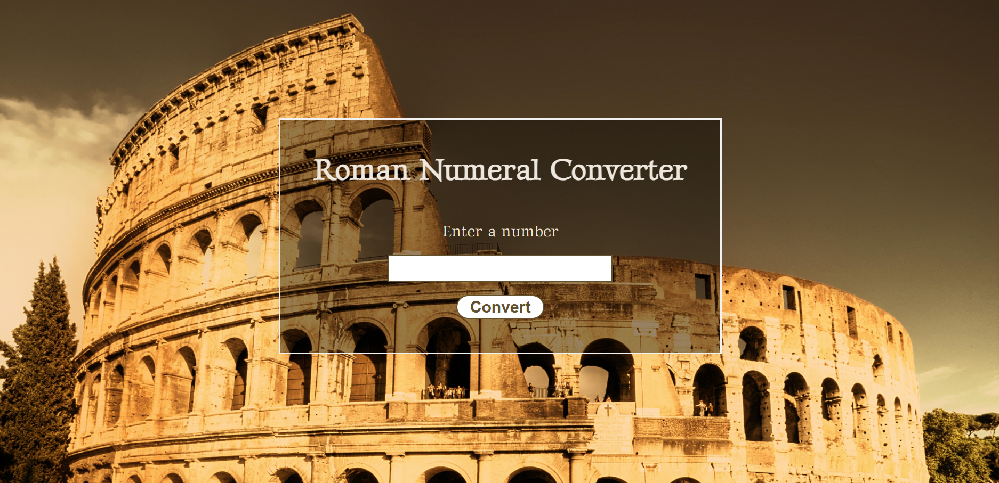

# Roman-Numeral-Converter
This project is a static website that converts numbers from 1 to 3999 to their Roman numeral representation.

# License
This project is licensed under the MIT License.

# Preview

# Live Demo
You can access a live version of this application from [here](https://hadil-jilani.github.io/Roman-Numeral-Converter/)
